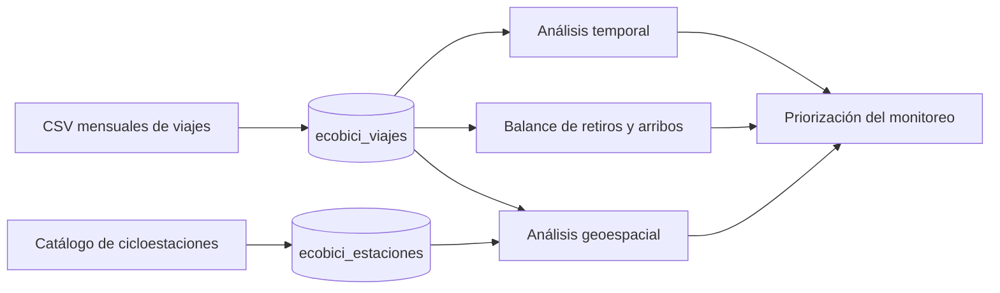
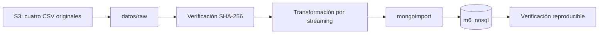

[`Conceptos avanzados de bases de datos NoSQL`](../../README.md) > `Proyecto final ECOBICI`

# Patrones espacio-temporales de desequilibrio de flujo en ECOBICI

## Problema y objetivo

ECOBICI permite retirar una bicicleta en una cicloestación y devolverla en otra. Debido a que los viajes no regresan necesariamente al lugar de origen, algunas estaciones pueden registrar durante ciertos periodos más retiros que arribos, mientras que otras presentan el comportamiento contrario. Estas diferencias producen un desequilibrio de flujo observado que puede repetirse según la estación, la hora y el tipo de día.

El objetivo es analizar los viajes completados durante el primer trimestre de 2026 para identificar qué cicloestaciones presentan patrones recurrentes de desequilibrio, cuándo se concentran y si aparecen de manera aislada o junto con estaciones cercanas. El proyecto pertenece al dominio de movilidad urbana, micromovilidad y gestión operativa de sistemas públicos de bicicletas compartidas.



## Personas usuarias y decisión apoyada

El usuario principal es el personal encargado del monitoreo y la operación de ECOBICI. SEMOVI y el personal de planeación de movilidad son usuarios secundarios, mientras que las personas usuarias del sistema son beneficiarias indirectas.

La solución apoyará la decisión de priorizar qué cicloestaciones y qué periodos deben someterse a mayor monitoreo o revisión debido a patrones recurrentes de desequilibrio de flujo. No decidirá cuántas bicicletas mover, qué vehículo utilizar ni qué ruta seguir.

## Preguntas del proyecto

**Pregunta principal:** ¿Qué cicloestaciones presentan los desequilibrios recurrentes de flujo más pronunciados entre retiros y arribos, y en qué días y franjas horarias se concentran?

**Preguntas secundarias:**

1. ¿Cómo cambia el balance de flujo entre horas pico y horas de menor utilización, así como entre días laborables y fines de semana?
2. ¿Existen zonas donde varias cicloestaciones cercanas presentan simultáneamente patrones semejantes de presión neta de entrada o salida?
3. ¿Qué cicloestaciones mantienen patrones de desequilibrio similares durante las semanas analizadas y cuáles presentan un comportamiento variable?

## Alcance y límites

- La unidad de origen es un viaje completado publicado por ECOBICI.
- El periodo se delimita mediante los archivos mensuales de enero a marzo de 2026, organizados por mes de arribo.
- Se utilizan identificadores de estación, fechas, horas y coordenadas oficiales.
- Se excluyen género, edad e identificador de bicicleta porque no son necesarios para las preguntas del proyecto.
- No se observan viajes intentados que no pudieron realizarse, inventarios históricos, movimientos internos del operador ni trayectorias GPS.
- Un desequilibrio de flujo no demuestra que una estación haya quedado vacía o llena.
- El resultado apoya la priorización del monitoreo, pero no constituye un algoritmo de redistribución ni una predicción de demanda.

Los CSV originales no se versionan. Sus fuentes, tamaños, conteos y hashes se documentan en [`datos/README.md`](datos/README.md).

## Carga y ejecución

La carga se realiza desde la terminal integrada de AWS Academy Learner Lab. Git transporta los scripts y la documentación; S3 transporta únicamente los cuatro CSV originales. No se guardan credenciales ni nombres de bucket, y los archivos descargados en `datos/raw/` no se versionan.



Desde la raíz del clon, prepara MongoDB e instala la versión fijada de `mongoimport`:

```bash
cd ~/m6-nosql
bash setup/setup.sh
bash proyecto_final/ecobici/scripts/instalar_mongoimport.sh
```

En la consola web de S3, crea un bucket de la sesión y dentro de él una carpeta llamada `ecobici`. Sube allí los cuatro objetos con estas claves exactas: `ecobici/2026-01.csv`, `ecobici/2026-02.csv`, `ecobici/2026-03.csv` y `ecobici/cicloestaciones_ecobici.csv`.

Después, desde la terminal de Learner Lab, crea la carpeta local de entrada y descarga ese prefijo. Sustituye `NOMBRE-DEL-BUCKET` por el nombre real; no escribas llaves de acceso en el comando ni en ningún archivo:

```bash
mkdir -p proyecto_final/ecobici/datos/raw

aws s3 cp \
  s3://NOMBRE-DEL-BUCKET/ecobici/ \
  proyecto_final/ecobici/datos/raw/ \
  --recursive \
  --only-show-errors
```

Los nombres dentro de `datos/raw/` deben ser exactamente `2026-01.csv`, `2026-02.csv`, `2026-03.csv` y `cicloestaciones_ecobici.csv`. Comprueba su integridad antes de modificar la base:

```bash
cd ~/m6-nosql/proyecto_final/ecobici/datos/raw
sha256sum -c ../manifest.sha256
cd ~/m6-nosql
```

Ejecuta la carga completa con un solo comando:

```bash
bash proyecto_final/ecobici/scripts/cargar_datos.sh
```

El cargador verifica nuevamente los hashes, restablece exclusivamente `ecobici_viajes` y `ecobici_estaciones`, procesa los archivos secuencialmente, importa Extended JSON mediante entrada estándar y ejecuta las comprobaciones finales. No genera una segunda copia transformada de los 4.7 millones de viajes en disco.

Una ejecución correcta termina con:

```text
Verificación correcta: la carga ECOBICI coincide con el contrato auditado.
Carga ECOBICI completa y verificada en la base m6_nosql.
```

El procedimiento se comprobó el 25 de agosto de 2026 en AWS Academy Learner Lab con MongoDB Server y MongoDB Shell 4.4.29, además de `mongoimport` 100.17.0. La ejecución terminó con código `0`, sin documentos fallidos, después de cargar 4 707 285 documentos en `ecobici_viajes` y 677 en `ecobici_estaciones`.

El verificador también comprueba los conteos mensuales, las banderas de calidad, la conversión de fechas, la geometría, la trazabilidad y la exclusión de género, edad e identificador de bicicleta. La comprobación final recorre la colección completa y ejecuta `validate`, por lo que puede tardar varios minutos y no debe interrumpirse.

La carga es repetible desde un estado conocido. Si la transformación, la importación o la verificación detectan un error, el cargador intenta eliminar los documentos ECOBICI parciales y advierte si no puede hacerlo. Un cierre abrupto del laboratorio todavía podría interrumpir esa limpieza; en cualquiera de esos casos, vuelve a ejecutar `cargar_datos.sh`, que restablecerá únicamente las dos colecciones del proyecto antes de comenzar.

El restablecimiento elimina también los índices secundarios y validadores que se añadan en fases posteriores. Por ello, el orden reproducible final será cargar los datos y después ejecutar los futuros scripts de validación e indexación.

Para utilizar otra ubicación local sin mover los CSV, define una variable específica al ejecutar:

```bash
ECOBICI_RAW_DIR=/ruta/a/los/csv \
  bash proyecto_final/ecobici/scripts/cargar_datos.sh
```
