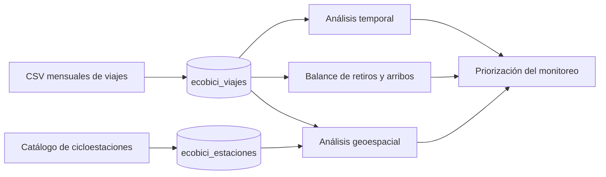
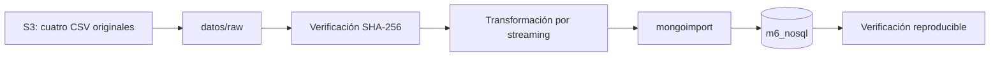
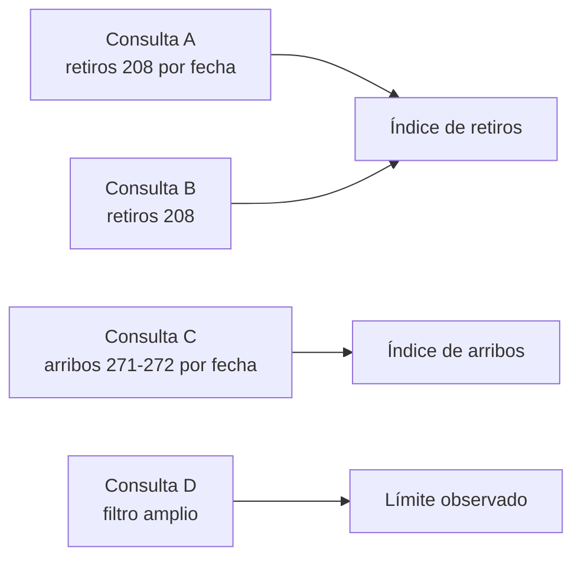
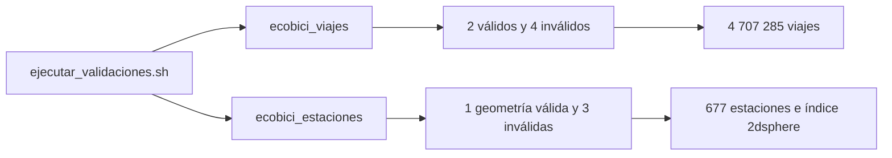
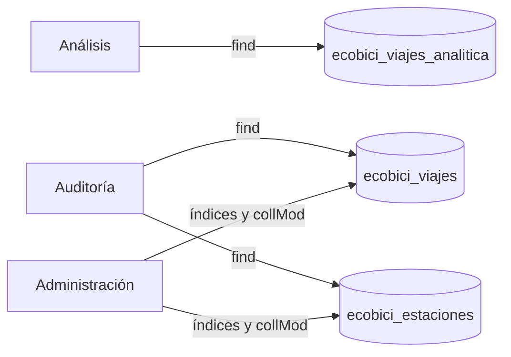

[`Conceptos avanzados de bases de datos NoSQL`](../../README.md) > `Proyecto final ECOBICI`

# Patrones espacio-temporales de desequilibrio de flujo en ECOBICI

## Problema y objetivo

ECOBICI permite retirar una bicicleta en una cicloestación y devolverla en otra. Debido a que los viajes no regresan necesariamente al lugar de origen, algunas estaciones pueden registrar durante ciertos periodos más retiros que arribos, mientras que otras presentan el comportamiento contrario. Estas diferencias producen un desequilibrio de flujo observado que puede repetirse según la estación, la hora y el tipo de día.

El objetivo es analizar los viajes completados durante el primer trimestre de 2026 para identificar qué cicloestaciones presentan patrones recurrentes de desequilibrio, cuándo se concentran y si aparecen de manera aislada o junto con estaciones cercanas. El proyecto pertenece al dominio de movilidad urbana, micromovilidad y gestión operativa de sistemas públicos de bicicletas compartidas.



## Personas usuarias y decisión apoyada

El usuario principal es el personal encargado del monitoreo y la operación de ECOBICI. SEMOVI y el personal de planeación de movilidad son usuarios secundarios, mientras que las personas usuarias del sistema son beneficiarias indirectas.

La solución apoyará la decisión de priorizar qué cicloestaciones y qué periodos deben someterse a mayor monitoreo o revisión debido a patrones recurrentes de desequilibrio de flujo. No decidirá cuántas bicicletas mover, qué vehículo utilizar ni qué ruta seguir.

## Preguntas del proyecto

**Pregunta principal:** ¿Qué cicloestaciones presentan los desequilibrios recurrentes de flujo más pronunciados entre retiros y arribos, y en qué días y franjas horarias se concentran?

**Preguntas secundarias:**

1. ¿Cómo cambia el balance de flujo entre horas pico y horas de menor utilización, así como entre días laborables y fines de semana?
2. ¿Existen zonas donde varias cicloestaciones cercanas presentan simultáneamente patrones semejantes de presión neta de entrada o salida?
3. ¿Qué cicloestaciones mantienen patrones de desequilibrio similares durante las semanas analizadas y cuáles presentan un comportamiento variable?

## Alcance y límites

- La unidad de origen es un viaje completado publicado por ECOBICI.
- El periodo se delimita mediante los archivos mensuales de enero a marzo de 2026, organizados por mes de arribo.
- Se utilizan identificadores de estación, fechas, horas y coordenadas oficiales.
- Se excluyen género, edad e identificador de bicicleta porque no son necesarios para las preguntas del proyecto.
- No se observan viajes intentados que no pudieron realizarse, inventarios históricos, movimientos internos del operador ni trayectorias GPS.
- Un desequilibrio de flujo no demuestra que una estación haya quedado vacía o llena.
- El resultado apoya la priorización del monitoreo, pero no constituye un algoritmo de redistribución ni una predicción de demanda.

Los CSV originales no se versionan. Sus fuentes, tamaños, conteos y hashes se documentan en [`datos/README.md`](datos/README.md).

## Carga y ejecución

La carga se realiza desde la terminal integrada de AWS Academy Learner Lab. Git transporta los scripts y la documentación; S3 transporta únicamente los cuatro CSV originales. No se guardan credenciales ni nombres de bucket, y los archivos descargados en `datos/raw/` no se versionan.



Desde la raíz del clon, prepara MongoDB e instala la versión fijada de `mongoimport`:

```bash
cd ~/m6-nosql
bash setup/setup.sh
bash proyecto_final/ecobici/scripts/instalar_mongoimport.sh
```

En la consola web de S3, crea un bucket de la sesión y dentro de él una carpeta llamada `ecobici`. Sube allí los cuatro objetos con estas claves exactas: `ecobici/2026-01.csv`, `ecobici/2026-02.csv`, `ecobici/2026-03.csv` y `ecobici/cicloestaciones_ecobici.csv`.

Después, desde la terminal de Learner Lab, crea la carpeta local de entrada y descarga ese prefijo. Sustituye `NOMBRE-DEL-BUCKET` por el nombre real; no escribas llaves de acceso en el comando ni en ningún archivo:

```bash
mkdir -p proyecto_final/ecobici/datos/raw

aws s3 cp \
  s3://NOMBRE-DEL-BUCKET/ecobici/ \
  proyecto_final/ecobici/datos/raw/ \
  --recursive \
  --only-show-errors
```

Los nombres dentro de `datos/raw/` deben ser exactamente `2026-01.csv`, `2026-02.csv`, `2026-03.csv` y `cicloestaciones_ecobici.csv`. Comprueba su integridad antes de modificar la base:

```bash
cd ~/m6-nosql/proyecto_final/ecobici/datos/raw
sha256sum -c ../manifest.sha256
cd ~/m6-nosql
```

Ejecuta la carga completa con un solo comando:

```bash
bash proyecto_final/ecobici/scripts/cargar_datos.sh
```

El cargador verifica nuevamente los hashes, restablece exclusivamente `ecobici_viajes` y `ecobici_estaciones`, procesa los archivos secuencialmente, importa Extended JSON mediante entrada estándar y ejecuta las comprobaciones finales. No genera una segunda copia transformada de los 4.7 millones de viajes en disco.

Una ejecución correcta termina con:

```text
Verificación correcta: la carga ECOBICI coincide con el contrato auditado.
Carga ECOBICI completa y verificada en la base m6_nosql.
```

El procedimiento se comprobó el 25 de agosto de 2026 en AWS Academy Learner Lab con MongoDB Server y MongoDB Shell 4.4.29, además de `mongoimport` 100.17.0. La ejecución terminó con código `0`, sin documentos fallidos, después de cargar 4 707 285 documentos en `ecobici_viajes` y 677 en `ecobici_estaciones`.

El verificador también comprueba los conteos mensuales, las banderas de calidad, la conversión de fechas, la geometría, la trazabilidad y la exclusión de género, edad e identificador de bicicleta. La comprobación final recorre la colección completa y ejecuta `validate`, por lo que puede tardar varios minutos y no debe interrumpirse.

La carga es repetible desde un estado conocido. Si la transformación, la importación o la verificación detectan un error, el cargador intenta eliminar los documentos ECOBICI parciales y advierte si no puede hacerlo. Un cierre abrupto del laboratorio todavía podría interrumpir esa limpieza; en cualquiera de esos casos, vuelve a ejecutar `cargar_datos.sh`, que restablecerá únicamente las dos colecciones del proyecto antes de comenzar.

El restablecimiento elimina también los índices secundarios y validadores que se añadan en fases posteriores. Por ello, el orden reproducible será cargar los datos, ejecutar las cinco consultas, realizar la comparación de planes, aplicar los validadores y ejecutar al final la configuración idempotente de la vista y los roles; las dos consultas geográficas crearán únicamente `ubicacion_2dsphere` en `ecobici_estaciones`, mientras que la medición de rendimiento restablece y crea sólo los índices secundarios documentados de `ecobici_viajes`.

Para utilizar otra ubicación local sin mover los CSV, define una variable específica al ejecutar:

```bash
ECOBICI_RAW_DIR=/ruta/a/los/csv \
  bash proyecto_final/ecobici/scripts/cargar_datos.sh
```

## Consultas reproducibles

El universo principal es la cohorte de 4 707 285 viajes cuyos arribos pertenecen a los archivos de enero, febrero y marzo de 2026. La consulta de balance cuenta los dos extremos de todos esos viajes; por ello, el balance global de la cohorte debe ser cero. Los 104 viajes mayores de 24 horas permanecen incluidos y auditables, tal como se decidió durante el modelado.

Las consultas horaria y semanal utilizan el momento real de cada retiro o arribo y aplican intervalos semiabiertos en la zona `America/Mexico_City`. Como los archivos se seleccionaron por mes de arribo, no contienen los retiros de viajes que terminaron en abril. En consecuencia, estos resultados describen los extremos observados dentro de la cohorte cargada y no deben presentarse como un registro completo de todos los eventos del trimestre ni como inventario de bicicletas.

El identificador no catalogado `1000` se conserva en el control global, pero sólo se excluye el extremo correspondiente de los rankings operativos. El otro extremo de esos viajes sigue participando cuando pertenece a una estación catalogada. La dirección del balance se define siempre como `arribos - retiros`: un valor positivo indica presión neta de entrada observada y uno negativo indica presión neta de salida observada.

| Script | Pregunta y unidad | Igualdad o rango | Ordenamiento | Arreglos | Importancia y volumen |
|---|---|---|---|---|---|
| `consultas/01_balance_cohorte.js` | Prioriza estaciones por balance acumulado de la cohorte completa. | No aplica un rango adicional; agrupa los dos extremos de los viajes cargados. | Balance descendente para presión de entrada y ascendente para presión de salida, seguido de movimientos e identificador. | Ejecuta dos pipelines `$group → $project → $sort` y combina en JavaScript sólo sus resúmenes por estación; no consulta campos de arreglo. | Presenta cinco estaciones de entrada y cinco de salida y procesa 4 707 285 retiros y 4 707 285 arribos. |
| `consultas/02_patrones_horarios.js` | Compara cada estación por día de semana y hora local, además de laborables frente a fines de semana. | `calidad.retiroEnCatalogo = true` o `calidad.arriboEnCatalogo = true`, con cada instante en `[2026-01-01, 2026-04-01)`. | Magnitud del balance medio direccional, movimientos e identificador; los contrastes horarios se ordenan por actividad. | Ejecuta dos pipelines `$match → $addFields → $group → $project → $sort` y combina únicamente los resúmenes estación-día-hora. | Presenta cinco estaciones distintas y compara para cada una los periodos de mayor y menor actividad en laborables y fines de semana. |
| `consultas/03_consistencia_semanal.js` | Identifica estaciones con dirección recurrente o cambiante durante doce intervalos semanales completos dentro de la cohorte observada. | Bandera de catálogo y cada instante en `[2026-01-05, 2026-03-30)`. | Recurrencia, consistencia y magnitud para patrones recurrentes; evidencia, menor consistencia y mayor salto para cambios de dirección. | Ejecuta dos pipelines `$match → $addFields → $group → $project → $sort`; JavaScript completa el calendario fijo y compara semanas consecutivas como en el curso. | Presenta cinco patrones recurrentes de entrada, cinco de salida y cinco casos cambiantes entre las 677 estaciones. |
| `consultas/04_concentracion_geografica.js` | Determina si estaciones cercanas presentan el mismo sentido de balance en una combinación común de día y hora. | Selecciona las tres estaciones más próximas dentro de 1 km mediante `$geoNear`; la distancia es una definición reproducible del proyecto. | Cantidad de vecinas coincidentes, magnitud conjunta e identificador. | Repite el pipeline estación-día-hora y aplica el patrón `2dsphere → $geoNear → $project` del ejemplo 11 de la semana 3. | Presenta tres entornos de entrada y tres de salida sin afirmar disponibilidad simultánea en tiempo real. |
| `consultas/05_priorizacion_monitoreo.js` | Integra estación, recurrencia, consistencia, día, hora y coincidencia geográfica para responder la pregunta principal. | Usa el trimestre para el patrón horario, doce semanas completas para recurrencia y el mismo entorno máximo de 1 km. | Recurrencia, consistencia, magnitud semanal e identificador; no usa una puntuación ponderada. | Reutiliza los pipelines temporales anteriores y el conteo de tres vecinas mediante `$geoNear`; no crea una colección de resultados. | Presenta cinco prioridades de entrada y cinco de salida en una salida ejecutiva única. |

Los controles esperados no fijan de antemano los rankings. La primera consulta exige 4 707 285 retiros, 4 707 285 arribos, balance global `0`, 9 414 452 extremos catalogados y balance catalogado `-38`; también comprueba los 40 retiros y 78 arribos asociados con `1000`. La segunda exige 4 707 132 retiros y 4 707 207 arribos catalogados dentro del trimestre, un resumen de 24 horas para cada tipo de día y cinco comparaciones completas. La tercera exige 4 505 019 retiros, 4 504 990 arribos, 677 series de doce semanas y fechas conocidas en la primera, segunda y última semana. La cuarta reutiliza los conteos horarios y exige cinco anclas de entrada y cinco de salida, mientras que la quinta vuelve a comprobar los cuatro conteos temporales y las 677 estaciones antes de generar diez prioridades. Los conteos temporales se contrastaron directamente contra los CSV auditados.

Para esta consulta, el pico observado se define de forma reproducible como las tres horas con más movimientos promedio por día y se contrasta con las tres de menor actividad, por separado para laborables y fines de semana. No se impone una franja externa. La magnitud del balance medio direccional se calcula como el valor absoluto del balance acumulado para una combinación estación-día-hora dividido entre la cantidad de días comparables; los cambios de signo se cancelan, por lo que no equivale al promedio de magnitudes diarias. La cercanía se define como las tres estaciones más próximas encontradas dentro de 1 km; una vecina sólo coincide cuando su balance tiene el mismo signo en la combinación de día y hora del ancla. Esta regla estudia coincidencia de patrones agregados y no inventario simultáneo. En el análisis semanal, la recurrencia es la mayor proporción alcanzada por entrada o salida respecto de las doce semanas y la consistencia compara ese sentido sólo entre semanas con balance distinto de cero. Si ambas direcciones aparecen seis veces, el patrón es mixto y ambos indicadores valen `0.5`; no se afirma que exista una dirección dominante. Una estación se considera cambiante únicamente si presenta semanas de entrada y de salida; esos casos se priorizan por la cantidad de semanas con evidencia antes de comparar consistencia y salto máximo. El salto máximo consecutivo no se interpreta como toda la variabilidad.

La comparación semanal reutiliza la lógica de variaciones consecutivas practicada en el curso. Los pipelines temporales se limitan a `$match`, `$addFields`, `$group`, `$project`, `$sort`, `$dateToString` y `$sum`; el análisis espacial usa únicamente `2dsphere`, `$geoNear` y `$project`, igual que el ejemplo 11 de la semana 3. JavaScript sólo combina resúmenes pequeños de retiros y arribos, completa los intervalos conocidos, calcula comparaciones consecutivas y prepara la salida compacta, como en los ejemplos 15 y 16 de la semana 4. Las consultas geográficas crean el índice requerido `ubicacion_2dsphere`, pero ninguna consulta crea colecciones derivadas ni resúmenes permanentes.

Después de cargar y verificar los datos, ejecuta desde la raíz del clon:

```bash
bash proyecto_final/ecobici/scripts/ejecutar_consultas.sh
```

Cada consulta comprueba primero los conteos de la carga y después valida invariantes propios. Una ejecución correcta termina con:

```text
Consultas ECOBICI completas y verificadas.
```

La versión final de las cinco consultas se ejecutó el 25 de agosto de 2026 en AWS Academy Learner Lab y terminó con código `0`. Coincidieron los controles de la cohorte completa, los intervalos horarios del trimestre, las doce semanas completas, las 677 estaciones evaluadas y el índice geoespacial `ubicacion_2dsphere`; el ejecutor generó también la comparación temporal ampliada, los entornos geográficos y la priorización ejecutiva sin excepciones.

En esta fase son esperables recorridos completos de `ecobici_viajes`; por eso cada pipeline puede tardar varios minutos. El índice `ubicacion_2dsphere` se trata por separado porque `$geoNear` lo requiere para funcionar.

## Medición e índices

La estrategia reproduce el procedimiento de los ejemplos 05 y 06 y del reto 03: conserva cada consulta, obtiene su plan con `explain("executionStats")`, crea como máximo dos índices secundarios y repite exactamente la misma medición. El análisis se concentra en `COLLSCAN`, `IXSCAN`, la presencia de `SORT`, `nReturned`, `totalKeysExamined` y `totalDocsExamined`. También registra `executionTimeMillis`, pero no lo interpreta como una mejora general porque puede variar entre ejecuciones.

Las consultas A y C recuperan como máximo cien eventos recientes de las principales estaciones detectadas en la fase analítica. La consulta B comprueba el uso del prefijo del índice de retiros. La consulta D conserva el filtro amplio inicial del análisis horario para observar sus límites: como abarca casi toda la colección y omite el primer campo de los índices, su plan no se presupone de antemano.



| Consulta | Igualdades | Rango y orden | Propósito de la medición |
|---|---|---|---|
| A | `retiro.estacionId = 208` y `calidad.retiroEnCatalogo = true` | Trimestre y `retiro.ocurrioEn` descendente, con límite de 100 | Comprobar acceso dirigido y ausencia de `SORT` independiente. |
| B | `retiro.estacionId = 208` | No aplica | Comprobar el prefijo del índice de retiros. |
| C | `arribo.estacionId = 271-272` y `calidad.arriboEnCatalogo = true` | Trimestre y `arribo.ocurrioEn` descendente, con límite de 100 | Comprobar acceso dirigido y ausencia de `SORT` independiente. |
| D | `calidad.retiroEnCatalogo = true` | Trimestre, sin ordenamiento | Observar el comportamiento de un filtro que cubre 4 707 132 extremos. |

La comparación se ejecutó en AWS Academy Learner Lab sobre los 4 707 285 viajes cargados y conservó la cantidad de resultados de las cuatro consultas. Los tiempos se registran como evidencia de esa ejecución, pero la comparación principal se basa en las etapas del plan y en las claves y documentos examinados.

| Consulta | Plan inicial | Plan con los dos índices | Resultado observado |
|---|---|---|---|
| A | `SORT` y `COLLSCAN`; 4 707 285 documentos; 0 claves; 3 035 ms | `LIMIT`, `FETCH` e `IXSCAN`; 100 documentos; 100 claves; 21 ms | Usó `retiro_estacion_catalogo_fecha_desc`, evitó examinar 4 707 185 documentos y ya no requirió `SORT`. |
| B | `COLLSCAN`; 4 707 285 documentos; 0 claves; 1 918 ms | `FETCH` e `IXSCAN`; 29 697 documentos; 29 697 claves; 59 ms | Usó el prefijo de `retiro_estacion_catalogo_fecha_desc` y evitó examinar 4 677 588 documentos. |
| C | `SORT` y `COLLSCAN`; 4 707 285 documentos; 0 claves; 2 181 ms | `LIMIT`, `FETCH` e `IXSCAN`; 100 documentos; 100 claves; 25 ms | Usó `arribo_estacion_catalogo_fecha_desc`, evitó examinar 4 707 185 documentos y ya no requirió `SORT`. |
| D | `COLLSCAN`; 4 707 285 documentos; 0 claves; 3 852 ms | `COLLSCAN`; 4 707 285 documentos; 0 claves; 3 898 ms | Conservó el mismo plan porque devolvió 4 707 132 documentos; los índices dirigidos por estación no ayudan a este filtro amplio. |

Los patrones creados son:

```javascript
{
  "retiro.estacionId": 1,
  "calidad.retiroEnCatalogo": 1,
  "retiro.ocurrioEn": -1
}
```

```javascript
{
  "arribo.estacionId": 1,
  "calidad.arriboEnCatalogo": 1,
  "arribo.ocurrioEn": -1
}
```

Los campos de igualdad aparecen antes del campo temporal. Esto permite recorrer por fecha dentro de una estación y una condición de catálogo conocidas; colocar `retiro.estacionId` primero también permite que la consulta B reutilice ese prefijo. Los índices no se presentan como una optimización universal: consumen almacenamiento y memoria, añaden trabajo a las escrituras y no evitan los recorridos completos que requiere el balance global.

El archivo `indices/01_comparar_planes.js` elimina únicamente los índices secundarios de `ecobici_viajes`, verifica que la medición inicial use sólo `_id_`, crea los dos índices y comprueba que las consultas A, B y C los utilicen sin cambiar la cantidad de resultados. No elimina `ubicacion_2dsphere` porque ese índice pertenece a `ecobici_estaciones`. La medición mediante `find().explain()` describe el acceso asociado con los filtros seleccionados y no se presenta como el tiempo total de los pipelines Q1–Q5.

Ejecuta desde la raíz del clon:

```bash
mkdir -p proyecto_final/ecobici/salidas
set -o pipefail

bash proyecto_final/ecobici/scripts/ejecutar_indices.sh 2>&1 | tee proyecto_final/ecobici/salidas/indices_learner_lab.txt

codigoIndices=${PIPESTATUS[0]}
echo "Código final de la medición: $codigoIndices"
```

Una ejecución correcta termina con:

```text
Medición e índices ECOBICI completos y verificados.
Código final de la medición: 0
```

## Validación

La primera validación se concentra en `ecobici_viajes`, la colección principal indicada en el modelo. El archivo `validaciones/01_validar_viajes.js` sigue los ejemplos 07 y 08 y el reto 04 de la semana 2: aplica `$jsonSchema` mediante `collMod`, usa nivel `strict` y acción `error`, y relaciona cada inserción aceptada o rechazada con una regla concreta.

| Campo o ruta | Tipo BSON | Presencia | Restricción aplicada |
|---|---|---|---|
| Documento raíz | `object` | Obligatorio | Debe incluir `_id`, `retiro`, `arribo`, `duracionSegundos`, `fuente` y `calidad`. |
| `_id` | `string` | Obligatorio | Conserva identificadores textuales. |
| `retiro` y `arribo` | `object` | Obligatorio | Cada objeto exige `estacionId` y `ocurrioEn`. |
| `retiro.estacionId` y `arribo.estacionId` | `string` | Obligatorio | Conservan ceros y códigos compuestos. |
| `retiro.ocurrioEn` y `arribo.ocurrioEn` | `date` | Obligatorio | Los instantes deben almacenarse como fechas BSON. |
| `duracionSegundos` | `int` | Obligatorio | `minimum: 1`; una duración nula o negativa no representa un viaje completado. |
| `fuente.archivo` | `string` | Obligatorio | Sólo admite `2026-01.csv`, `2026-02.csv` o `2026-03.csv`. |
| `fuente.filaCsv` | `int` | Obligatorio | `minimum: 2`, porque la primera línea corresponde al encabezado. |
| Campos de `calidad` | `bool` | Obligatorio | Las cuatro banderas deben estar presentes y ser booleanas. |

La validación geoespacial extiende las mismas reglas a `ecobici_estaciones`, como solicita la guía de la semana 3 cuando la geometría ya es estable. Exige los campos del catálogo, los documentos anidados `direccion`, `ubicacion` y `fuente`, el tipo constante `Point`, al menos dos coordenadas numéricas y el intervalo general `[-180, 180]`. La transformación conserva las reglas específicas de orden y estructura: exactamente dos valores, longitud en `[-180, 180]` y latitud en `[-90, 90]`. El archivo `validaciones/02_validar_estaciones.js` crea de forma idempotente el mismo índice `ubicacion_2dsphere` utilizado por las consultas y después comprueba su definición; por ello, la validación no depende de que la consulta geoespacial se haya ejecutado desde la carga más reciente.

| Prueba geográfica | Resultado esperado | Regla aislada |
|---|---|---|
| Punto público de prueba | Aceptado | `Point` con dos componentes numéricos dentro del intervalo. |
| `LineString` con los mismos componentes | Rechazado | `ubicacion.type` sólo admite `Point`. |
| `Point` con una sola coordenada | Rechazado | `coordinates` exige `minItems: 2`. |
| `Point` con longitud `200` | Rechazado | Los componentes tienen `maximum: 180`. |



Los dos casos válidos comprueban un viaje ordinario y otro mayor de 24 horas con un retiro en `1000`. El segundo confirma que las anomalías auditadas se conservan cuando mantienen la estructura requerida. Los cuatro casos inválidos aíslan la ausencia de `retiro`, una fecha guardada como cadena, una duración igual a cero y un archivo fuera del dominio permitido.

Los validadores protegen presencia, tipos, mínimos, documentos anidados, el dominio de la fuente mensual y la estructura geográfica estable. No demuestran que una estación referenciada exista ni pueden comprobar por sí solos que la duración sea igual a la diferencia entre los instantes o que las banderas derivadas sean coherentes. Tampoco demuestran la exactitud o vigencia de una coordenada. Esas relaciones permanecen en `scripts/verificar_carga.js` y `scripts/transformar_datos.py`, que ya recorrieron la carga completa sin encontrar documentos incompatibles con estas reglas.

Ejecuta desde la raíz del clon después de la medición de índices:

```bash
mkdir -p proyecto_final/ecobici/salidas
set -o pipefail

bash proyecto_final/ecobici/scripts/ejecutar_validaciones.sh 2>&1 | tee proyecto_final/ecobici/salidas/validaciones_learner_lab.txt

codigoValidaciones=${PIPESTATUS[0]}
echo "Código final de la validación: $codigoValidaciones"
```

Una ejecución correcta acepta dos viajes, rechaza cuatro viajes inválidos, acepta una geometría, rechaza tres geometrías inválidas, elimina los datos temporales y termina con:

```text
Validación JSON Schema ECOBICI completa y verificada.
Validación geoespacial ECOBICI completa y verificada.
Validaciones JSON Schema ECOBICI completas y verificadas.
Código final de la validación: 0
```

La validación completa se ejecutó el 25 de agosto de 2026 en AWS Academy Learner Lab con código `0`. En `ecobici_viajes`, los dos documentos válidos fueron aceptados, las cuatro inconsistencias aisladas fueron rechazadas y la limpieza conservó 4 707 285 viajes. En `ecobici_estaciones`, una geometría válida fue aceptada, tres geometrías inválidas fueron rechazadas, se confirmó `ubicacion_2dsphere`, la colección temporal fue eliminada y permanecieron las 677 estaciones originales.

## Seguridad y privacidad

Esta fase aplica únicamente los patrones de los ejemplos 19 y 20 y del reto 10 de la semana 5: una vista creada con `createView` y `$project`, tres roles personalizados, inspección mediante `getRole` y una matriz de acceso. La vista `ecobici_viajes_analitica` conserva `retiro`, `arribo` y las dos banderas de pertenencia al catálogo. Excluye `_id`, `fuente`, `duracionSegundos` y las dos banderas de calidad que no participan en las preguntas del proyecto.



El rol `analista_ecobici` recibe sólo `find` sobre la vista. `auditor_ecobici` recibe `find` sobre las dos colecciones fuente sin escritura. `administrador_ecobici` recibe `listIndexes`, `createIndex`, `dropIndex` y `collMod` sobre esas colecciones sin recibir `find`. La clasificación, las acciones no concedidas y las pruebas positivas y negativas de diseño se encuentran en [`seguridad/matriz_acceso.md`](seguridad/matriz_acceso.md).

Los datos de ECOBICI utilizados son públicos y género, edad e identificador de bicicleta ya fueron excluidos durante la carga. Aun así, la vista se describe como minimizada y no como anónima porque conserva combinaciones de estación y fecha que podrían relacionarse con información externa. Ningún script contiene usuarios, contraseñas, tokens, llaves de acceso ni nombres particulares de buckets.

Ejecuta desde la raíz del clon después de las validaciones:

```bash
mkdir -p proyecto_final/ecobici/salidas
set -o pipefail

bash proyecto_final/ecobici/scripts/ejecutar_seguridad.sh 2>&1 | tee proyecto_final/ecobici/salidas/seguridad_learner_lab.txt

codigoSeguridad=${PIPESTATUS[0]}
echo "Código final de seguridad: $codigoSeguridad"
```

Una ejecución correcta muestra cinco documentos minimizados, la matriz compacta, los tres roles y termina con:

```text
Seguridad y acceso mínimo ECOBICI completos y verificados.
Seguridad y privacidad ECOBICI completas y verificadas.
Código final de seguridad: 0
```

La instancia local del curso no habilita autorización. Por ello, el ejecutor crea e inspecciona roles, pero no crea usuarios ni contraseñas y no presenta las pruebas negativas diseñadas como denegaciones ejecutadas. La vista tampoco sustituye las cinco consultas analíticas ni demuestra cifrado, conservación, respaldos o administración de credenciales; esos controles requieren un entorno configurado para comprobarlos.

## Entrega final

El reporte de seis páginas integra las semanas 1 a 5 e incluye cinco capturas con contexto, resultado y demostración. Está disponible en [`entrega/fernando_ugalde_proyecto_nosql.pdf`](entrega/fernando_ugalde_proyecto_nosql.pdf); su fuente reproducible se conserva en [`entrega/reporte_final.html`](entrega/reporte_final.html).

Desde un estado conocido y con los cuatro CSV auditados en `proyecto_final/ecobici/datos/raw/`, el orden completo de ejecución es:

```bash
cd ~/m6-nosql

bash setup/setup.sh
bash proyecto_final/ecobici/scripts/instalar_mongoimport.sh
bash proyecto_final/ecobici/scripts/cargar_datos.sh
bash proyecto_final/ecobici/scripts/ejecutar_consultas.sh
bash proyecto_final/ecobici/scripts/ejecutar_indices.sh
bash proyecto_final/ecobici/scripts/ejecutar_validaciones.sh
bash proyecto_final/ecobici/scripts/ejecutar_seguridad.sh
```

El reporte puede utilizarse directamente para la exposición máxima de cinco minutos con esta distribución:

| Tiempo | Páginas | Contenido |
|---|---:|---|
| 0:00–0:40 | 1–2 | Problema, personas usuarias y pregunta principal. |
| 0:40–1:30 | 2 | Datos y decisiones del modelo documental. |
| 1:30–3:30 | 3–4 | Consulta principal y análisis temporal y geoespacial. |
| 3:30–4:20 | 5–6 | Índices, validación, seguridad y privacidad. |
| 4:20–5:00 | 6 | Resultado, limitación principal y mejora posible. |

La exposición debe explicar decisiones y resultados sin recorrer todo el código. Las cinco evidencias incluidas fueron obtenidas de ejecuciones finales en Learner Lab con código `0` y no contienen credenciales ni datos personales.
