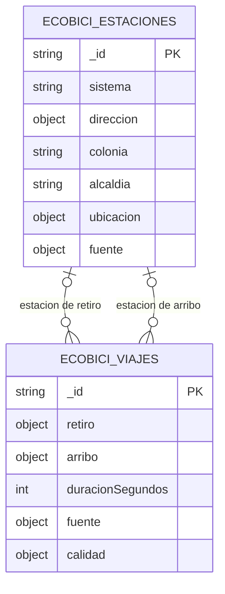
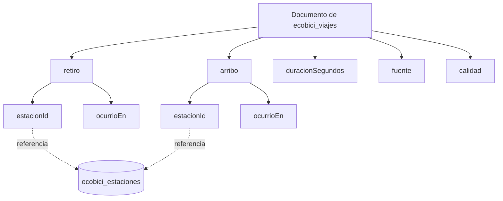

# Fuentes y modelo documental

## Procedencia y datos

Los datos son públicos y se descargaron el 24 de agosto de 2026. Los archivos de viajes proceden de [Datos abiertos de ECOBICI](https://ecobici.cdmx.gob.mx/datos-abiertos/) y el catálogo geográfico del [Portal de Datos Abiertos de la Ciudad de México](https://www.datos.cdmx.gob.mx/dataset/cicloestaciones-ecobici-nuevo-sistema).

| Archivo | Tamaño en bytes | Registros útiles | Función |
|---|---:|---:|---|
| `2026-01.csv` | 93 449 915 | 1 525 302 | Viajes con arribo en enero |
| `2026-02.csv` | 93 694 075 | 1 528 610 | Viajes con arribo en febrero |
| `2026-03.csv` | 101 340 383 | 1 653 373 | Viajes con arribo en marzo |
| `cicloestaciones_ecobici.csv` | 74 624 | 677 | Catálogo de ubicaciones |

Los CSV no se guardan en Git. Después de colocarlos en `datos/raw/`, su integridad podrá comprobarse desde Bash con:

```bash
cd proyecto_final/ecobici/datos/raw
sha256sum -c ../manifest.sha256
```

Los tres archivos de viajes contienen 4 707 285 registros, comparten el mismo encabezado de nueve columnas, no presentan filas mal formadas y no se detectaron duplicados exactos. Todos los arribos pertenecen al mes declarado por el archivo, mientras que 440 retiros pertenecen a meses anteriores. Se encontraron 104 viajes con duración superior a 24 horas; se conservarán con una bandera explícita y no serán corregidos ni eliminados silenciosamente.

El catálogo utiliza codificación Windows-1252, contiene 677 filas útiles y 312 filas completamente vacías al final. Conserva 12 identificadores compuestos, como `237-238`, y posee coordenadas válidas para sus 677 registros. Los identificadores `021` y `022` comparten coordenadas, pero representan códigos diferentes y no se deduplicarán. El identificador `1000` aparece en 114 viajes y 118 extremos, pero no existe en el catálogo; se conservará como referencia no catalogada, sin inventar una estación ni coordenadas.

## Modelo documental

La colección principal representa un viaje completado. Un documento mantiene juntos el retiro y el arribo porque ambos describen el mismo hecho y permiten calcular su duración. Las fechas y horas se interpretan en la zona `America/Mexico_City`, se almacenan como BSON `Date` en UTC y deberán convertirse nuevamente a la zona local cuando se agrupen por hora, día o semana.





**Colección principal — `ecobici_viajes`:** contendrá un documento por cada fila de los archivos mensuales. Los documentos anidados `retiro` y `arribo` separan los dos momentos y las dos estaciones. Sólo se conservarán los campos necesarios para responder las preguntas y mantener la trazabilidad.

**Colección relacionada — `ecobici_estaciones`:** contendrá un documento por cada fila útil del catálogo oficial. Dirección y geometría se almacenan una sola vez porque repetirlas en millones de viajes aumentaría el almacenamiento y permitiría versiones inconsistentes de una misma estación.

MongoDB no aplicará integridad foránea a las referencias. La carga calculará `retiroEnCatalogo` y `arriboEnCatalogo`; las consultas geográficas relacionarán las colecciones y continuarán únicamente cuando exista `ubicacion`. Así, `1000` permanecerá auditable sin recibir coordenadas inventadas.

No se utilizará una colección nativa de series de tiempo porque el proyecto debe funcionar en MongoDB 4.4 y 7.0. Tampoco se almacenará permanentemente el balance por estación: será un resultado calculado para el intervalo solicitado mediante pipelines reproducibles.

### Justificación de anidamiento y referencia

1. Un viaje se mantiene como un solo documento para conservar la unidad publicada y revisar retiro, arribo y duración sin reconstruir el hecho desde varias filas.
2. Retiro y arribo se embeben porque no tienen vida independiente del viaje y siempre deben interpretarse con su estación y momento.
3. Las estaciones se referencian porque dirección y coordenadas pertenecen a la estación y no deben duplicarse en 4.7 millones de documentos.
4. Los identificadores se almacenan como cadenas para conservar ceros iniciales y códigos compuestos.
5. Las banderas de calidad se embeben porque describen el registro al que pertenecen y permiten conservar anomalías sin convertirlas en hechos no comprobados.
6. Género, edad e identificador de bicicleta se excluyen conforme al principio de minimización.
7. Los balances temporales y espaciales se calcularán a partir de los viajes para evitar resúmenes desactualizados.

## Documentos representativos

**Viaje:** el siguiente documento corresponde al registro 44 de datos, ubicado en la línea física 45 de `2026-01.csv`. La hora local de la fuente se representa en UTC sumando seis horas.

```javascript
{
  _id: "2026-01:0000044",
  retiro: {
    estacionId: "087",
    ocurrioEn: ISODate("2026-01-01T06:06:57Z")
  },
  arribo: {
    estacionId: "099",
    ocurrioEn: ISODate("2026-01-01T06:11:21Z")
  },
  duracionSegundos: 264,
  fuente: {
    archivo: "2026-01.csv",
    filaCsv: 45
  },
  calidad: {
    duracionMayor24h: false,
    retiroFueraMesArribo: false,
    retiroEnCatalogo: true,
    arriboEnCatalogo: true
  }
}
```

**Cicloestación:**

```javascript
{
  _id: "087",
  sistema: "Ecobici",
  direccion: {
    callePrincipal: "Gante",
    calleSecundaria: "Venustiano Carranza"
  },
  colonia: "Centro",
  alcaldia: "Cuauhtemoc",
  sitioInstalacion: "Banqueta",
  estatusEnCatalogo: "Instalada",
  ubicacion: {
    type: "Point",
    coordinates: [-99.139705, 19.432024]
  },
  fuente: {
    archivo: "cicloestaciones_ecobici.csv",
    url: "https://datos.cdmx.gob.mx/dataset/a1d7c132-fb1b-4e8c-bb74-4bb618563eb2/resource/5fbacfcc-f677-406c-9356-6ced541240fe/download/cicloestaciones_ecobici.csv",
    fechaActualizacionPublicada: "2024-10-17",
    sha256: "305cc954e25942f6f57528bd95d1f7f46dd9880ed564f2ff4a477aeaca7f1a9d"
  }
}
```

## Diccionario de campos

### `ecobici_viajes`

| Campo o ruta | Tipo BSON | Presencia | Fuente o regla |
|---|---|---|---|
| `_id` | string | Obligatorio | `AAAA-MM:NNNNNNN`; el número es la posición del registro sin contar el encabezado |
| `retiro` | object | Obligatorio | Extremo de salida del viaje |
| `retiro.estacionId` | string | Obligatorio | Se conserva literalmente, incluidos ceros y guiones |
| `retiro.ocurrioEn` | date | Obligatorio | Fecha y hora de retiro convertidas a UTC |
| `arribo` | object | Obligatorio | Extremo de llegada del viaje |
| `arribo.estacionId` | string | Obligatorio | Se conserva literalmente, incluidos ceros y guiones |
| `arribo.ocurrioEn` | date | Obligatorio | Fecha y hora de arribo convertidas a UTC |
| `duracionSegundos` | int | Obligatorio | Campo derivado: `(arribo.ocurrioEn - retiro.ocurrioEn) / 1000` |
| `fuente` | object | Obligatorio | Trazabilidad del registro público |
| `fuente.archivo` | string | Obligatorio | Uno de los tres CSV mensuales |
| `fuente.filaCsv` | int | Obligatorio | Línea física del archivo, encabezado incluido |
| `calidad` | object | Obligatorio | Comprobaciones que no alteran la fuente |
| `calidad.duracionMayor24h` | bool | Obligatorio | Verdadero cuando la duración supera 86 400 segundos |
| `calidad.retiroFueraMesArribo` | bool | Obligatorio | Verdadero si retiro y arribo pertenecen a meses distintos |
| `calidad.retiroEnCatalogo` | bool | Obligatorio | Indica si el identificador existe en la instantánea descargada del catálogo |
| `calidad.arriboEnCatalogo` | bool | Obligatorio | Indica si el identificador existe en la instantánea descargada del catálogo |

### `ecobici_estaciones`

| Campo o ruta | Tipo BSON | Presencia | Fuente o regla |
|---|---|---|---|
| `_id` | string | Obligatorio | `num_cicloe`, sin convertirlo a número ni dividirlo |
| `sistema` | string | Obligatorio | Nombre del sistema en la fuente |
| `direccion` | object | Obligatorio | Componentes descriptivos de la ubicación |
| `direccion.callePrincipal` | string | Obligatorio | `calle_prin` |
| `direccion.calleSecundaria` | string | Obligatorio | `calle_secu` |
| `colonia` | string | Obligatorio | Colonia publicada |
| `alcaldia` | string | Obligatorio | Alcaldía publicada |
| `sitioInstalacion` | string | Obligatorio | `sitio_de_e` |
| `estatusEnCatalogo` | string | Obligatorio | Valor de la instantánea de 2024; no prueba el estado operativo en 2026 |
| `ubicacion` | object | Obligatorio | Punto GeoJSON |
| `ubicacion.type` | string | Obligatorio | Valor constante `Point` |
| `ubicacion.coordinates` | array | Obligatorio | Dos números en orden `[longitud, latitud]` |
| `fuente.archivo` | string | Obligatorio | Catálogo CSV oficial |
| `fuente.url` | string | Obligatorio | URL exacta de descarga |
| `fuente.fechaActualizacionPublicada` | string | Obligatorio | Fecha `AAAA-MM-DD` informada por el portal |
| `fuente.sha256` | string | Obligatorio | Hash de la instantánea auditada |

`duracionSegundos` se calculará exclusivamente durante la carga y se comprobará contra los dos instantes. El validador posterior no rechazará un viaje sólo por superar 24 horas ni por cruzar el límite mensual: conservará el documento y sus banderas. Los 114 viajes relacionados con `1000` y los 118 extremos sin geometría se contabilizarán por separado cuando se construya la evidencia geoespacial.

